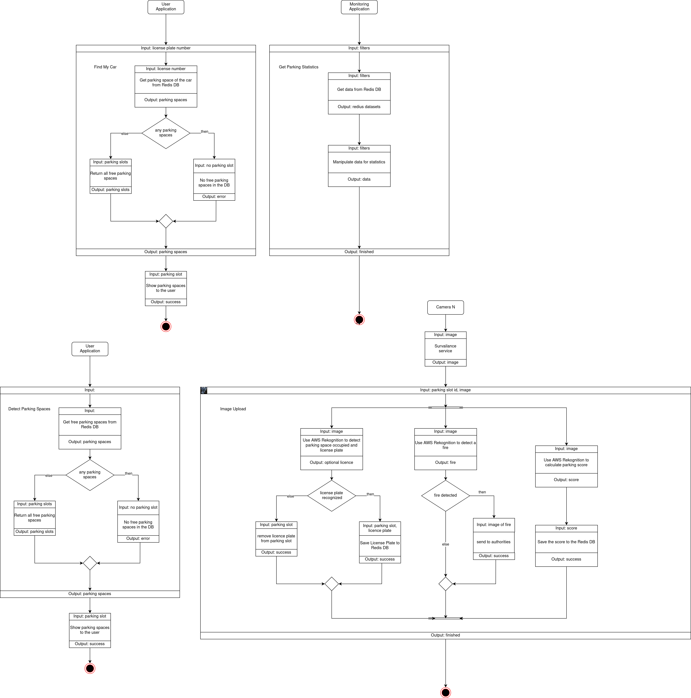

# Project: Smart Parking Management System

## Objective

The goal of this project is to develop a smart parking management system that leverages AWS Rekognition to detect and monitor numberplates of cars to help find empty parking spots and help users find their car again. This system aims to enhance parking efficiency, reduce time spent searching for parking, and minimize traffic congestion in urban areas.

## Tasks

1. **Parking Space Detection:** Implement AWS Rekognition to analyze real-time parking lot footage from strategically placed cameras. Utilize object detection and image analysis algorithms to identify occupied parking spaces and their number plate.

2. **Parking Data Management:** Employ Redis, a inmemory database, to store and manage parking availability data in a scalable and efficient manner.

4. **Mobile Application for Parking Guidance:** Design and develop a mobile application that provides real-time parking availability information to drivers and enables them to find their car again.

5. **Parking Utilization Monitoring and Optimization:** Create a dashboard for city officials to monitor parking utilization patterns across different parking lots and time periods. Analyze data to identify trends, optimize parking infrastructure.

## Benefits

1. **Reduced Parking Search Time:** Drivers can quickly locate vacant parking spots, minimizing time spent searching and reducing congestion.

2. **Improved Parking Efficiency:** Real-time parking availability information ensures that drivers are directed to available spots, optimizing parking lot usage.

3. **Enhanced Traffic Flow:** By reducing congestion caused by parking search, overall traffic flow is improved, contributing to a smoother driving experience.

4. **Data-driven Parking Management:** City officials can gain valuable insights from parking utilization data, enabling informed decisions for parking infrastructure planning and optimization.

## Potential Challenges

1. **Data Security and Privacy:** Robust data security measures are necessary to protect user privacy and prevent unauthorized access to sensitive parking data.

2. **Integration with Existing Parking Systems:** The system should seamlessly integrate with existing parking infrastructure and management systems to avoid disruptions and ensure compatibility. For example the tickets of the existing parking system could be correlated to the license plate to find the car again using the ticket.

## Lambda functions

The smart parking management system would require several AWS Lambda functions to handle different aspects of parking detection, data processing, and user interactions. Here's a breakdown of the essential Lambda functions:

1. **Parking Space Detection Lambda:** This Lambda function would continuously analyze real-time parking lot footage from cameras using AWS Rekognition. It would identify occupied and vacant parking spaces by applying object detection and image analysis algorithms. The function would then update a central database with the latest parking occupancy information.

2. **Find Your Car**: This Lambda function is used for the mobile application. A user can make a request using his parking ticket to find the location of hid car.

3. **Mobile Application Data Provision Lambda:** This Lambda function would handle requests from the mobile application for real-time parking availability information. It would query the central database and provide the app with the latest parking occupancy status for specific parking lots or areas.

4. **Fire Detection Lambda:** This Lambda function monitors the parking lot and calls in officials if there is something suspicious going on.

5. **Parking Score Lambda:** This Lambda function calculates a score according how good the car is placed into a slot.

## Workflow

